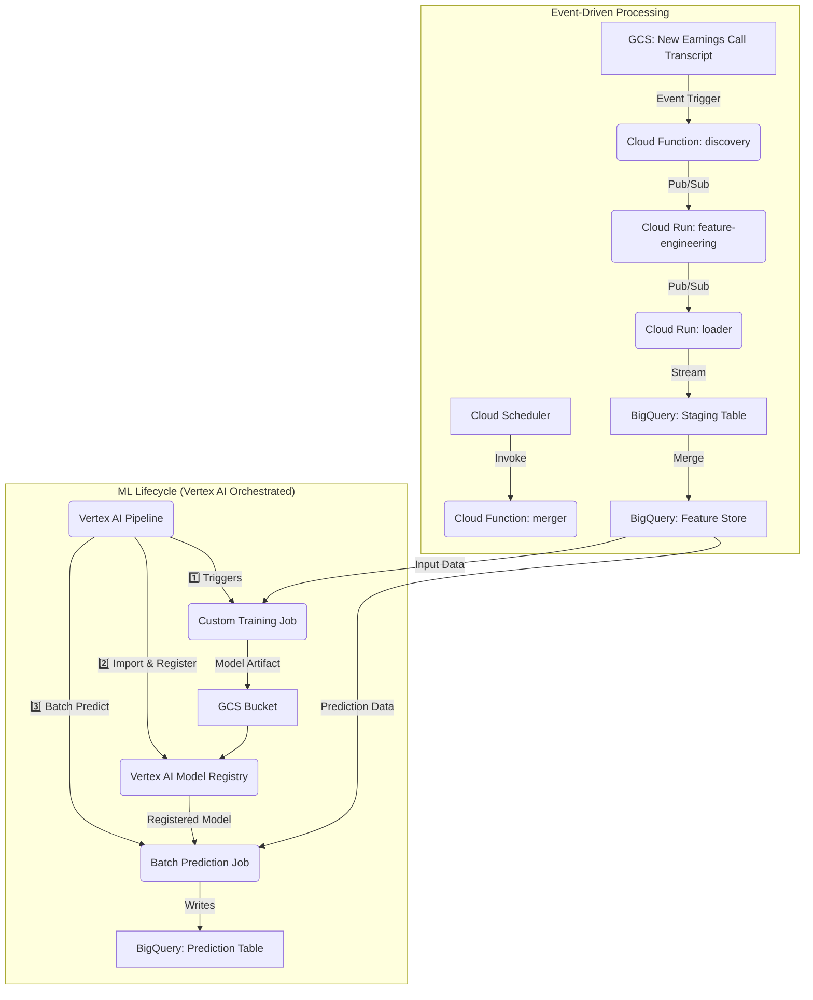

# ProfitScout ML Pipeline


## 1. Project Overview

The **ProfitScout ML Pipeline** is an end-to-end, serverless system on Google Cloud that predicts short-term stock price movements after quarterly earnings calls.

* **Ingests** earnings call transcripts.
* **Engineers** rich features using NLP, sentiment analysis, technical indicators, and fundamental surprises.
* **Orchestrates** a full ML lifecycle in Vertex AI—training, model registry, and batch prediction—showcasing production-grade MLOps.

***

## 2. Architecture

The project is composed of two main parts: an **Event-Driven Processing** pipeline for data ingestion and feature engineering and an **ML Lifecycle** pipeline for training and prediction.



***

## 3. Repository Structure

```
profitscout-models/
│
├── pipelines/
│   ├── compiled/
│   │   ├── training_pipeline.json
│   │   ├── inference_pipeline.json
│   │   └── hpo_pipeline.json
│   └── src/
│       ├── create_training_pipeline.py
│       ├── create_inference_pipeline.py
│       └── create_hpo_pipeline.py
│
├── src/
│   ├── training/
│   │   ├── main.py
│   │   ├── Dockerfile
│   │   └── requirements.txt
│   ├── prediction/
│   │   ├── main.py
│   │   ├── Dockerfile
│   │   └── requirements.txt
│   ├── feature_engineering/
│   │   ├── main.py
│   │   ├── processing.py
│   │   ├── Dockerfile
│   │   └── requirements.txt
│   ├── ingestion/
│   │   ├── discovery/
│   │   │   ├── main.py
│   │   │   └── requirements.txt
│   │   └── loader/
│   │       ├── main.py
│   │       └── requirements.txt
│   └── data_management/
│       ├── merger/
│       │   ├── main.py
│       │   └── requirements.txt
│       └── update_max_close/
│           ├── main.py
│           └── requirements.txt
│
├── scripts/
│   ├── training_job.py
│   ├── inference_job.py
│   └── backfill_features.py
│
└── README.md
CODE_BLOCK_PLACEHOLDER

***

## 4. Getting Started

### Prerequisites

* gcloud SDK configured
* A GCP project with the following APIs enabled:
    * Cloud Functions
    * Cloud Run
    * Artifact Registry
    * BigQuery
    * Vertex AI

### Setup & Deployment

1.  **Clone the Repository**

    ```bash
    git clone https://github.com/devdizzle/profitscout-models.git
    cd profitscout-models
    ```

2.  **Build and Push Container Images**

    Replace `YOUR_PROJECT` and `YOUR_REPO` with your GCP project ID and Artifact Registry repository name.

    ```bash
    gcloud builds submit src/training --tag us-central1-docker.pkg.dev/YOUR_PROJECT/YOUR_REPO/trainer:latest
    gcloud builds submit src/prediction --tag us-central1-docker.pkg.dev/YOUR_PROJECT/YOUR_REPO/predictor:latest
    gcloud builds submit src/feature_engineering --tag us-central1-docker.pkg.dev/YOUR_PROJECT/YOUR_REPO/feature-engineering:latest
    gcloud builds submit src/ingestion/loader --tag us-central1-docker.pkg.dev/YOUR_PROJECT/YOUR_REPO/loader:latest
    ```

3.  **Deploy Ingestion Services**

    Replace `YOUR_BUCKET`, `YOUR_PROJECT`, and `YOUR_DATASET` with your GCS bucket name, GCP project ID, and BigQuery dataset name.

    ```bash
    # Cloud Function: discovery
    gcloud functions deploy discover_new_summary --gen2 --runtime python311 \
        --trigger-resource YOUR_BUCKET \
        --trigger-event google.storage.object.finalize \
        --region us-central1 \
        --source src/ingestion/discovery

    # Cloud Run: feature-engineering
    gcloud run deploy feature-engineering \
        --image us-central1-docker.pkg.dev/YOUR_PROJECT/YOUR_REPO/feature-engineering:latest \
        --region us-central1

    # Cloud Run: loader
    gcloud run deploy loader \
        --image us-central1-docker.pkg.dev/YOUR_PROJECT/YOUR_REPO/loader:latest \
        --region us-central1 \
        --set-env-vars DESTINATION_TABLE=YOUR_DATASET.staging_table

    # Cloud Function: merger (scheduled)
    gcloud functions deploy merge_staging_to_final --gen2 --runtime python311 \
        --trigger-topic merge-features \
        --region us-central1 \
        --set-env-vars PROJECT_ID=YOUR_PROJECT,STAGING_TABLE=YOUR_DATASET.staging_table,FINAL_TABLE=YOUR_DATASET.feature_store \
        --source src/data_management/merger
    ```

4.  **Compile and Run the Pipelines**

    You can compile the pipelines using the provided scripts and then run them using the gcloud CLI.

    ```bash
    # Compile the pipelines
    python pipelines/src/create_training_pipeline.py
    python pipelines/src/create_inference_pipeline.py
    python pipelines/src/create_hpo_pipeline.py

    # Run a pipeline
    gcloud ai pipelines run --pipeline-file pipelines/compiled/training_pipeline.json \
        --region us-central1 \
        --project YOUR_PROJECT
    ```

***

## 5. How to Run the Pipeline

### Data Processing (Automated)

Upload a new `.txt` transcript to `gs://<BUCKET>/earnings-call-summaries/`. The event-driven architecture will automatically ingest the data and engineer the features.

### ML Training & Prediction (Manual or Scheduled)

You can manually trigger a pipeline run using the gcloud CLI, as shown in the setup instructions, or you can schedule pipeline runs using Cloud Scheduler.

To run a different pipeline, simply change the `--pipeline-file` argument to point to the desired pipeline JSON file (e.g., `inference_pipeline.json` or `hpo_pipeline.json`).